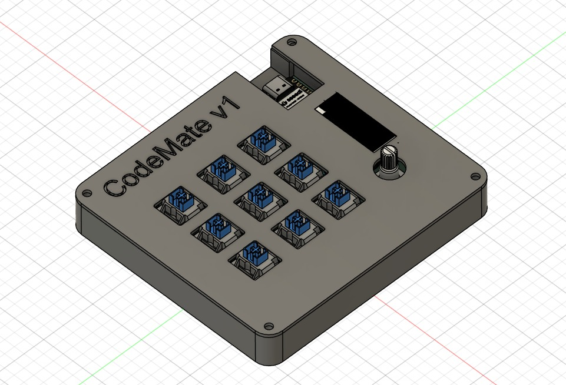
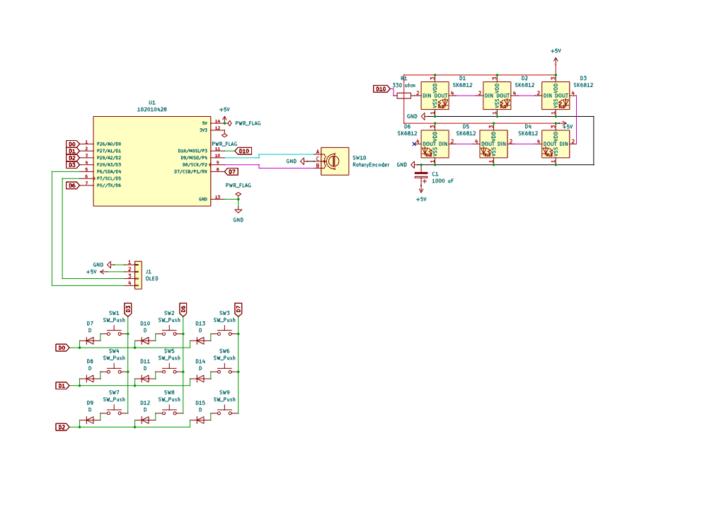
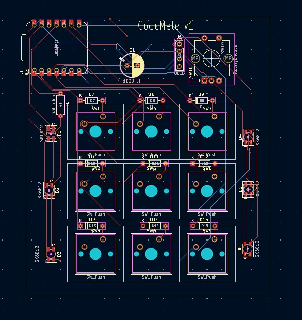

# CodeMate - My Dev Macropad

hiii! this is my hackpad submission. built a 3x3 macropad to speed up my coding workflow



## what it does

- 9 mechanical switches in a 3x3 grid for shortcuts and macros
- rotary encoder for volume/zoom/scrolling depending on layer
- 0.91" OLED that shows which layer im on and some cool things which i havent decided yete
- 6 RGB LEDs that change color based on mode (blue/green/purple)
- runs KMK firmware so i can customize everything

## PCB

heres what the electronics look like:

| Schematic | PCB |
|-----------|-----|
|  |  |

took me a few tries to get the routing right but it works now

[x] I ran DRC and there are 0 errors but few silkscreen warnings

## Case

made in fusion360. fits everything together with M3 screws and heatset inserts


the switches poke through the top plate and the oled sits in a cutout. pretty clean imo

## Firmware

using kmk for this! wrote custom macros for git commands, has 3 layers:

**Layer 0 (Blue) - Default:**
```
Copy    | Paste   | Undo
Cut     | Save    | Redo
Layer 1 | Layer 2 | Screenshot
```
Encoder: Volume up/down

**Layer 1 (Green) - Code Mode:**
```
Git Status | Terminal | F5 Debug
Git Commit | Comment  | TODO
(hold)     | Run Py   | Git Push
```
Encoder: Zoom in/out

**Layer 2 (Purple) - Media:**
```
Play/Pause | Next  | Prev
Mute       | Vol+  | Vol-
Back       | (hold)| Emoji
```
Encoder: Next/prev track

### how to switch layers

- **Hold bottom-left key** = Layer 1 (code mode, green)
- **Hold bottom-middle key** = Layer 2 (media mode, purple)
- **Release** = back to Layer 0 (default, blue)

the rgb leds change color so you always know which layer youre on

[x] no api keys or passwords in the code

## BOM

what you need to build this:

- 1x XIAO RP2040
- 9x Cherry MX switches  
- 9x 1N4148 diodes
- 6x SK6812 MINI-E LEDs
- 1x 0.91" SSD1306 OLED (128x32, I2C)
- 1x EC11 rotary encoder
- 1x 330Ω resistor (for LED data line)
- 1x 1000µF capacitor (bulk cap for LEDs)
- 4x M3x16mm screws
- 4x M3x5mmx4mm heatset inserts

## notes

this was fun to make! spent way too much time tweaking the firmware but learned a lot about kmk in the process. 
