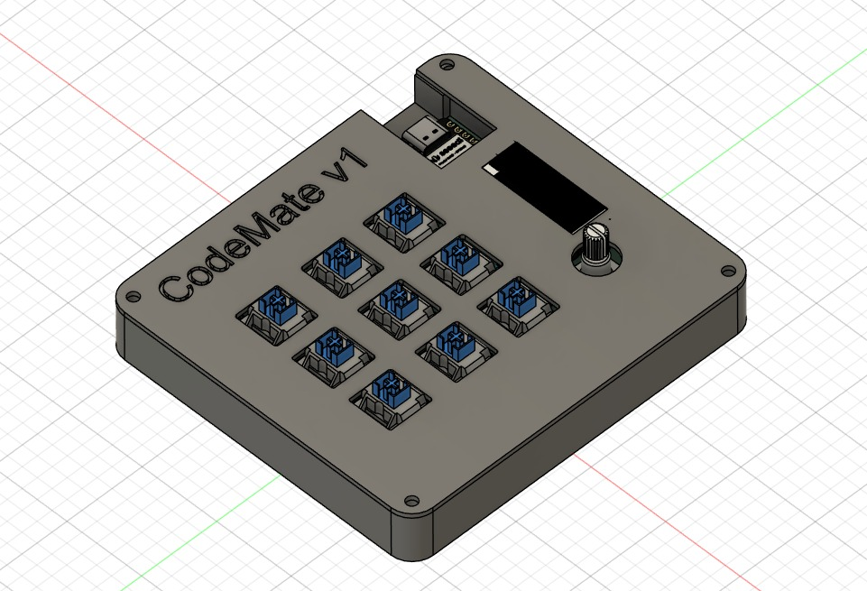
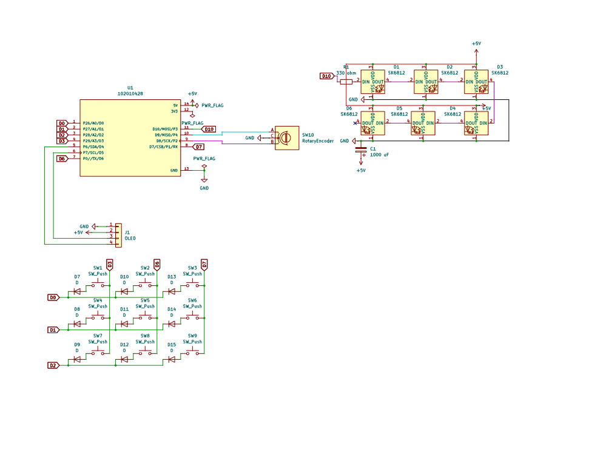
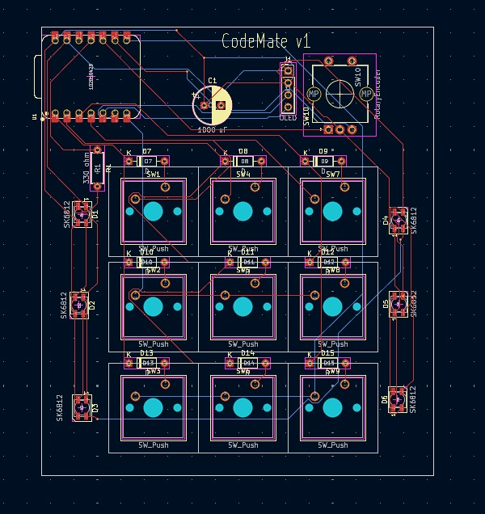
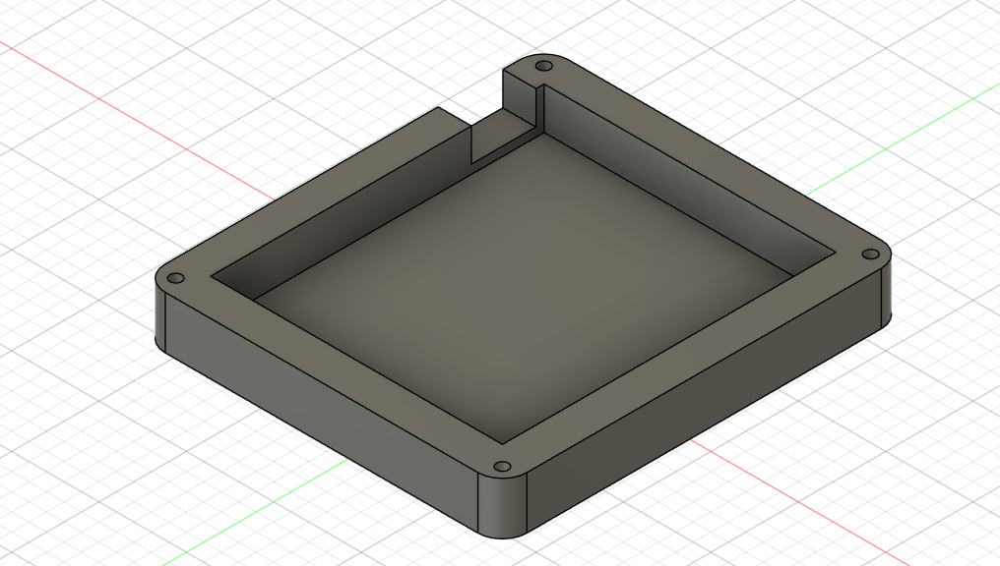
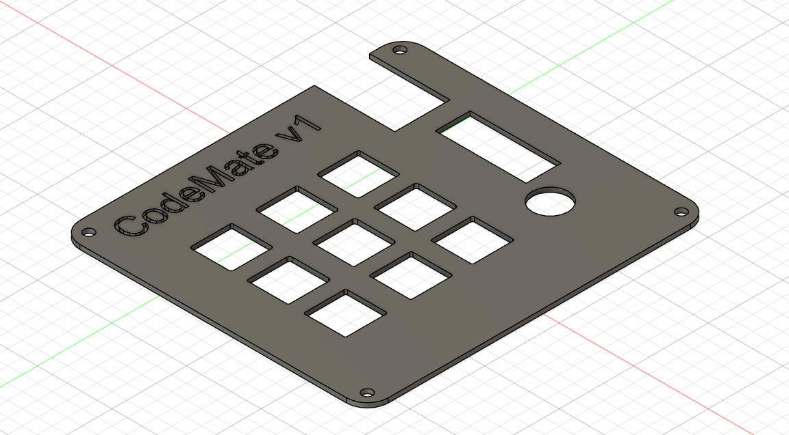
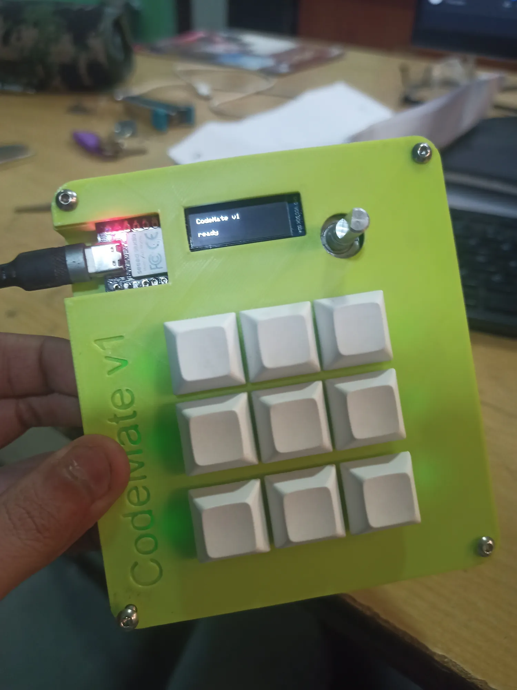
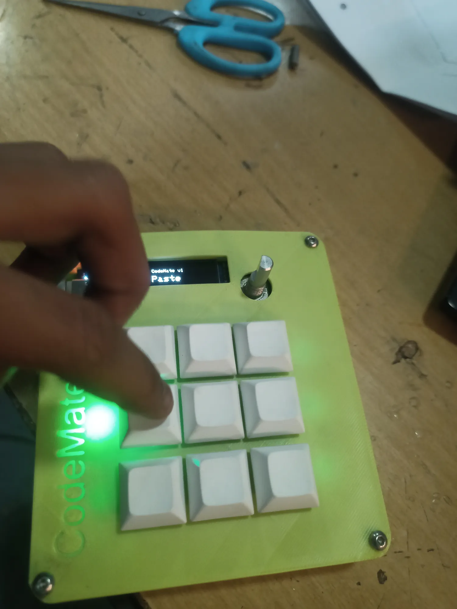
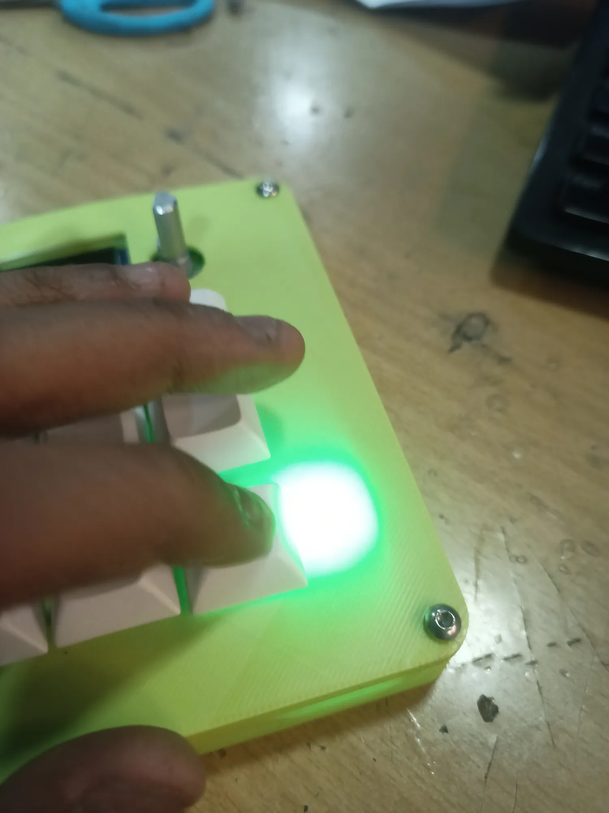

# CodeMate - My Dev Macropad
hiii! this is my hackpad submission. built a 3x3 macropad to speed up my coding workflow



## what it does
- 9 mechanical switches in a 3x3 grid for shortcuts and macros
- rotary encoder for volume control
- 0.91" OLED that shows which key i just pressed (flashes for 1.5sec then shows "ready")
- 6 RGB LEDs that breathe in warm amber and pulse when i hit keys
- runs on Arduino (not KMK anymore) so i can use TinyUSB

## PCB
heres what the electronics look like:

| Schematic | PCB |
|-----------|-----|
|  |  |

took me a few tries to get the routing right but it works now

[x] I ran DRC and there are 0 errors but few silkscreen warnings

## Case
made in fusion360. fits everything together with M3 screws and heatset inserts



along with the top:



the switches poke through the top plate and the oled sits in a cutout. pretty clean imo

## Firmware
rewrote it in Arduino because i wanted better HID support. NO LAYERS anymore, just 9 coding shortcuts that i actually use:

**The Layout:**
```
Comment      | Uncomment    | Block Comment
Run (F5)     | Debug (F5)   | Stop (F5)
git status   | git commit   | git push
```

Encoder: Volume up/down (stays the same always)

### what each key does
- **Key 0:** Toggle comment (Ctrl+/)
- **Key 1:** Uncomment line (Ctrl+Shift+/)
- **Key 2:** Block comment (Ctrl+Shift+A)
- **Key 3:** Run code (F5)
- **Key 4:** Start debugging (Shift+F5)
- **Key 5:** Stop debugging (Shift+F5)
- **Key 6:** Opens terminal + runs `git status`
- **Key 7:** Opens terminal + types `git commit -m ""` with cursor inside quotes
- **Key 8:** Opens terminal + runs `git push`

git commands automatically open the VS Code terminal first (Ctrl+Shift+`) then type the command. super handy

### LED behavior
- **Normal:** slow breathing effect (10% to 40% brightness) in warm amber
- **When you press a key:** the LED near that key flashes bright then fades back to breathing
- **Color:** warm amber (255, 140, 0) because one of my LEDs has a dead blue channel lol

the oled shows which key i pressed for 1.5 seconds then goes back to showing "ready"

[x] no api keys or passwords in the code

## BOM
what you need to build this:
- 1x XIAO RP2040
- 9x Cherry MX switches  
- 9x 1N4148 diodes
- 6x SK6812 MINI-E LEDs (NOT WS2812B, different color order)
- 1x 0.91" SSD1306 OLED (128x32, I2C)
- 1x EC11 rotary encoder
- 1x 330Ω resistor (for LED data line - optional but recommended)
- 1x 1000µF capacitor (bulk cap for LEDs - optional but recommended)
- 4x M3x16mm screws
- 4x M3x5mmx4mm heatset inserts

## notes
this was fun to make! spent way too much time tweaking the firmware but learned a lot about Arduino HID and how SK6812 LEDs work differently from WS2812B.

switched from KMK to Arduino because i wanted proper keyboard+consumer HID support and the encoder was being weird in KMK. plus now i can do the breathing LED effect which looks way cooler than static colors

GG

# this is the prototype:




## and when buttons are pressed it looks like:

